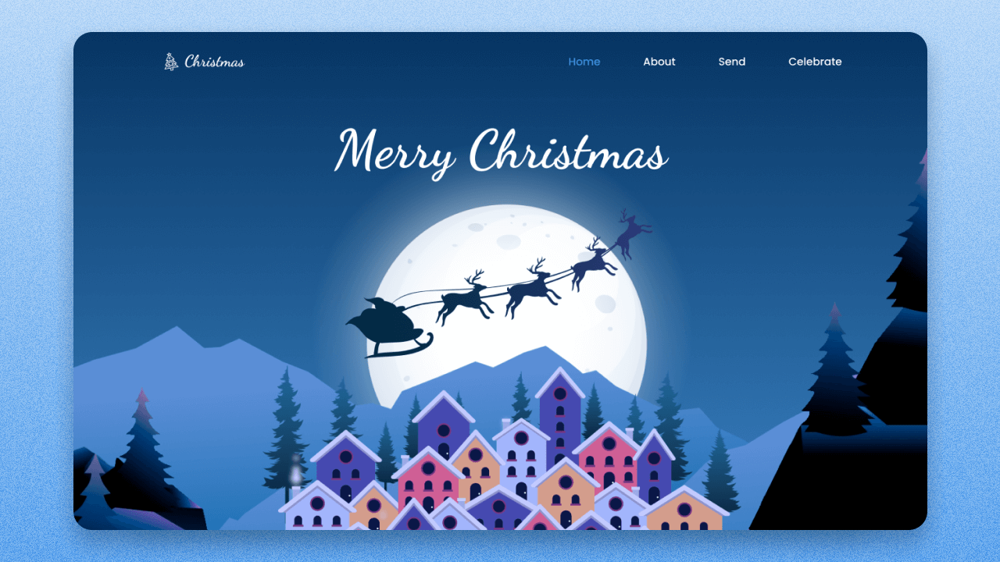

<div align="center">
    <h1 align="center">About Responsive Christmas Website Design Using HTML CSS & JavaScript | Parallax Scrolling Website ⛄️</h1>
    <p>Criação de um site com tema sobre natal</p>
    
</div>

---
<h3 align="center">
  <a href="https://responsive-christmas-website-2.vercel.app/">Acessar demonstração</a>
</h3>

## Índice

* [Descrição](#descrição)
* [Techs](#techs)
* [Design](#design)
  * [Cores](#cores)
  * [Tipo de fonte](#tipo-de-fonte)
  * [Pacote de ícones](#pacote-de-ícones)
* [Instalação](#instalação)
* [Links Contato](#links-contato)

# Descrição
Criação de um site com tema sobre natal para treino e fixação do conteúdo [**BedimCode**](https://www.youtube.com/channel/UCgkDs77BoEhMIgRUB4MKrtQ)

# Techs: 
- **HTML**
- **CSS**
- **Javascript**

# Design:
- O modelo final para desktop está disponível na pasta `./design`
- Imagens disponíveis na pasta `./assets`<br>

## Cores:
  --first-color: hsl(210, 80%, 54%);<br>
  --first-color-alt: hsl(210, 80%, 50%);<br>
  --title-color: hsl(210, 24%, 90%);<br>
  --text-color: hsl(210, 16%, 70%);<br>
  --white-color: #fff;<br>
  --body-color: hsl(210, 32%, 4%);<br>

## Tipo de fonte:
- **Dancing** Regular 400, Medium 500, Bold 700

## Pacote de ícones:
- **Remixicons**

# Instalação:
```bash
  # Clone este repositório:
  $ git clonehttps://github.com/GabrielChagas1/responsive-christmas-website-2.git
  $ cd ./responsive-christmas-website-2
```

# Links Contato
- **Linkedin:** https://www.linkedin.com/in/gabriel-serqueira-chagas/<br>
- **GitHub:** https://github.com/GabrielChagas1<br>